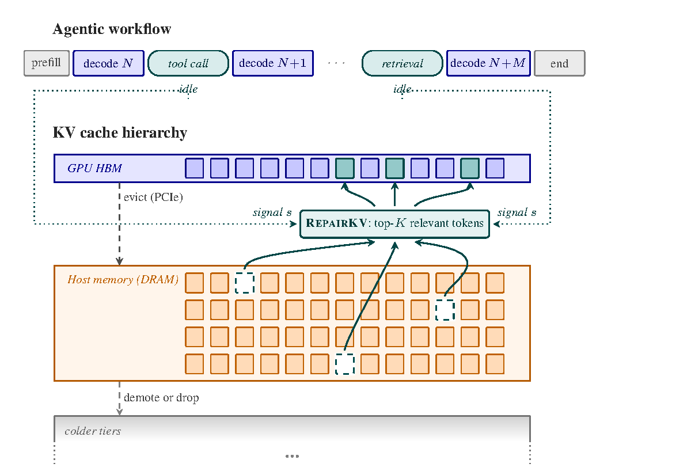
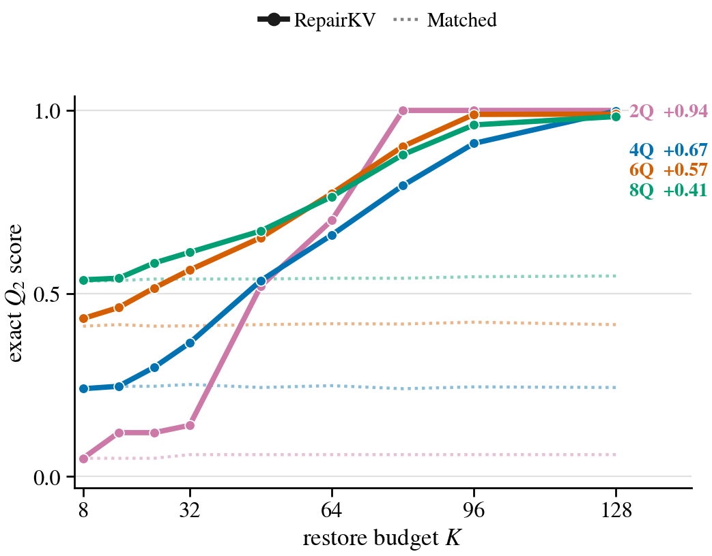

# RepairKV

**Cache You Later: Post-Compression KV Repair for Long-Context Agentic
LLM Inference.**



> *RepairKV system overview. During agent decode pauses (tool calls,
> retrievals), a selected signal `s` (a new user query, a tool result,
> retrieved content, or the model's recent generation) is used to rank
> host KV rows; the top-`K` are lifted back into GPU HBM at their
> original sequence positions.*

RepairKV is a research prototype for **post-compression KV cache repair** in
long-context, multi-turn LLM inference. Existing KV-cache compression methods
decide which past tokens stay active using only the information available at
compression time, and then treat that decision as one-way. In agentic
workflows, a later user turn, tool result, retrieved document, or browser
observation can shift which earlier context matters, but tokens that mattered
in later turns may already be evicted.

RepairKV treats the compressed cache as revisable. During the pause before
decoding resumes, it scores offloaded evicted KV rows against the next-turn
signal and promotes a small budgeted subset back into the active GPU cache.
The main comparisons use a **matched resumed active-cache budget**: RepairKV
is compared against no-repair and content-agnostic restore controls with the
same number of active context KV rows.

## Research Question

KV-cache compression decides which past tokens remain active before the next
turn is known. RepairKV asks a narrower question:

> If a future turn reveals new evidence about which past tokens matter, can a
> runtime revise the active KV state during a pause without increasing the
> resumed active-cache budget?

This is a mechanism study, not a production serving stack. Model weights stay
fixed; the runtime revises which historical context the next decode can
directly attend to.

## Headline Result

On Qwen2.5-7B-Instruct at 32K context, RepairKV reaches **91.0%** retrieval
on a four-query needle-in-a-haystack task versus **24.5%** for the matched
no-repair baseline at the same active-cache budget, with only **96** promoted
tokens.



> *Raw `Q_2` score under matched resumed-cache budgets. Solid:
> RepairKV; dotted: matched no-repair. Right labels: query count and
> `Δ_96` (gain at `K=96`).*

## Method at a Glance

At each pause boundary, the abstraction has three objects:

- `C_base`: active evictable KV, with `|C_base| = B_base` (base
  active-cache budget).
- `W_N`: offloaded evicted KV, hidden from decoding unless promoted.
- `s`: the pause-boundary signal used to score evicted KV (a new user
  query, a tool result, the model's recent generation, or other tokens
  indicating upcoming significance).

The repair operator chooses `S_K(s) ⊆ W_N` with `|S_K| ≤ K`, and resumes
from `C_repair = C_base ∪ S_K` at resumed active-cache budget
`|C_repair| ≤ B_base + K`. The matched no-repair baseline `B_match` reaches
the same active budget by applying the base eviction policy at
`B_base + K`, so both conditions decode under the same number of active
context KV rows.

The current prototype scores rows with post-RoPE `Q_2` query tensors
against active and offloaded keys, then expands each top-ranked anchor
into a right-biased `(L, R) = (2, 20)` local burst under a strict `K`
budget.

## Scope and Prerequisites

- The matched budget is the resumed active context KV budget. RepairKV also
  keeps an offloaded evicted-KV store; storage, scoring, and transfer costs
  are reported separately as service costs.
- The runtime figure is a single-node capacity envelope for score/select/
  promote mechanics, not a trace-backed distribution of real tool-call wait
  times.
- Paper-grade GPU runs assume local model weights under `models/`, the
  vendored `ruler/` checkout, CUDA/PyTorch, and enough GPU memory for the
  selected model and context length.
- CPU tests and figure-rendering checks can be run without launching new GPU
  experiments.

## Evidence in This Repository

- **Controlled benchmark.** Split-query multi-query needle-in-a-haystack
  (MQ-NIAH) derived from RULER, providing explicit cross-turn relevance
  shifts and annotated future-relevant spans.
- **Primary model.** Qwen2.5-7B-Instruct at 32K rendered context on a
  single RTX PRO 6000 Blackwell GPU.
- **Matched-budget frontier.** MQ-NIAH-2Q/4Q/6Q/8Q sweeps over
  `K = 8, 16, 24, 32, 48, 64, 80, 96, 128`. Random-K and Oldest-K stay
  near matched no-repair; RepairKV beats both content-agnostic controls
  on every balanced partition at `K = 128`.
- **Next-turn signal specificity.** At `K = 48` on MQ-NIAH-4Q,
  RepairKV gains `+0.326` over matched no-repair while StaleQ-K and
  WrongQ-K stay within `+0.028`. Refresh-buffered reaches `1.000`,
  showing that relevant rows remain available for stronger selectors.
- **Repeated relevance shifts.** Five-turn MQ-NIAH-8Q revisit schedule
  (`K = 80`, `n = 24`): RepairKV gains `+0.542` over matched no-repair on
  non-initial turns (95% CI `[0.458, 0.620]`), while Random-K and
  Oldest-K gain only `+0.010` and `+0.021`.
- **Eviction-policy sensitivity.** RepairKV improves over each
  policy's matched no-repair baseline under SnapKV-style, H2O-style,
  StreamingLLM-style, and Scissorhands-style first-stage eviction.
- **Real-repository diagnostic.** 48 callsite examples from 12 pinned
  open-source repositories drawn from the SWE-bench pool. At `K = 192`,
  event-only RepairKV improves exact identifier accuracy from
  **18.8%** (matched no-repair) to **72.9%**; label-assisted references
  (File-gated RepairKV at 83.3%, AnchorWindow-K at 89.6%) show remaining
  headroom. Not a SWE-bench issue-resolution benchmark.
- **Runtime envelope.** At `K = 5000`, p95 repair latency is
  **50 ms** at 32K offloaded candidates, **1.20 s** at 1M, and
  **4.64 s** at 4M. At `K = 96`, the full repair takes ~**110 ms**
  (p95) versus ~2.13 s for full-prefix prefill on the same system.

## Paper

- Source: `paper/main.tex`
- Rebuilt PDF: `paper/main.pdf`
- Figure renderer: `paper/scripts/render_paper_figures.py`
- Writing and venue guide: kept locally, not tracked.

Rebuild the paper from the repo root:

```bash
.venv/bin/python paper/scripts/render_paper_figures.py
cd paper
latexmk -pdf -interaction=nonstopmode -halt-on-error main.tex
```

LaTeX intermediates are written to `paper/aux/` by `paper/.latexmkrc`.
Undefined references, undefined citations, overfull boxes, or figure overlap
should be fixed before a paper snapshot.

## Reproducing Checks

Run the focused active diagnostic tests:

```bash
.venv/bin/python -m pytest \
  phases/phase15_real_repo_relevance_shift/tests \
  phases/phase6_repair/tests/test_runner.py -q
```

Run focused paper and closure tests:

```bash
.venv/bin/python -m pytest \
  phases/phase14_critical_flaw_closure/tests/test_audit_phase14_readiness.py \
  phases/phase13_iteration_framework/tests/test_paper_language.py \
  phases/phase13_iteration_framework/tests/test_framework.py \
  phases/phase10_expansion/tests/test_multiturn.py \
  phases/phase10_expansion/tests/test_multiturn_runner.py -q
```

Run the broader CPU-side suite:

```bash
.venv/bin/python -m pytest -q
```

GPU experiments should start with the smallest smoke test that can falsify the
design, then move to a locked run only after the smoke passes a written gate.

## Repository Map

- `paper/`: ICML-style paper draft, figure assets, and rendering scripts.
- `phases/phase6_repair/`: core matched-budget repair protocol, selectors,
  reporting, and unit tests.
- `phases/phase9_experiment_deepening/` through
  `phases/phase14_critical_flaw_closure/`: completed experiment expansions,
  smoke evaluators, locked-run wrappers, and paper-readiness audits.
- `phases/phase15_real_repo_relevance_shift/`: completed appendix
  diagnostic for real-repository relevance shifts.
- `phases/phase18_pre_submission/`: pre-submission supplement (selector
  ablations and time-budgeted query-aware baselines).
- `phases/<phase>/saved_results/`: small tracked summaries from earlier
  runs, kept so the repo retains a lightweight memory of canonical
  outputs even if local generated `results/` trees are pruned.
- `docs/`: project status and result-retention notes.
- `models/`: local model weights; ignored by git.
- `ruler/`: vendored RULER checkout; treated as external benchmark code.

## Experiment Vocabulary

- `Matched no-repair` (`B_match`): no repair under the same resumed
  active-cache budget. Primary baseline for all main claims.
- `RepairKV`: scores evicted KV rows against the next-turn signal and
  promotes a `K`-budgeted subset back into the active cache before
  decoding resumes.
- `Random-K`, `Oldest-K`: content-agnostic restore controls that promote
  from the same evicted KV store as RepairKV without scoring against the
  next-turn signal.
- `StaleQ-K`: scores using the previous-turn query rather than the
  upcoming one. Specificity control.
- `WrongQ-K`: scores using another example's next-turn query.
  Specificity control.
- `Refresh-buffered`: reselects the full resumed active budget from active
  plus offloaded rows using the next-turn signal. A method-boundary
  reference for selector headroom, not a deployable full-prefix recompute
  baseline.
- `ToolFile-K`: file-name-assisted control for the real-repository
  diagnostic, with oldest-row backfill.
- `File-gated RepairKV`: label-assisted reference that restricts repair
  candidates to the event-named file.
- `AnchorWindow-K`: label-assisted locality reference for the
  real-repository diagnostic.
- `SpanRef-K`: appendix-only diagnostic over annotated future answer-span
  groups. Enumerates feasible annotated span-group subsets with cost at
  most `K`; not an implementable algorithm and not a universal upper
  bound over all possible K-token repairs.

## Active Questions

- What stronger next-turn-aware selectors close the gap to Refresh-buffered
  and the label-assisted references (File-gated, AnchorWindow-K)?
- How should repair lift from token-row promotion to page- or block-level
  promotion in a production KV-tiering stack?
- What scheduler-aware policy decides when to repair across arbitrary turn,
  tool, retrieval, or state-change boundaries rather than only at the
  fixed two-turn pause boundary?
- What trace-scheduled repair experiment best connects the
  runtime-capacity envelope to real tool/environment wait distributions?

## Git Hygiene

Generated phase outputs, local model weights, LaTeX intermediates, and rendered
plot binaries are ignored unless deliberately promoted. Keep paper-ready source
changes in tracked code, `.tex`, `.md`, and compact CSV artifacts that are
needed to regenerate figures.
